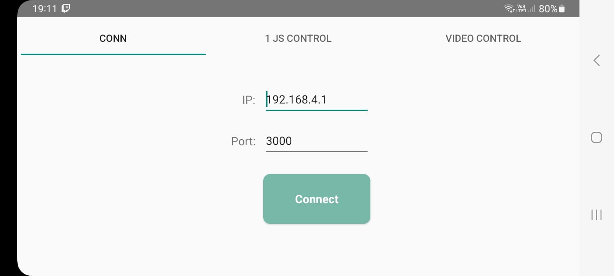
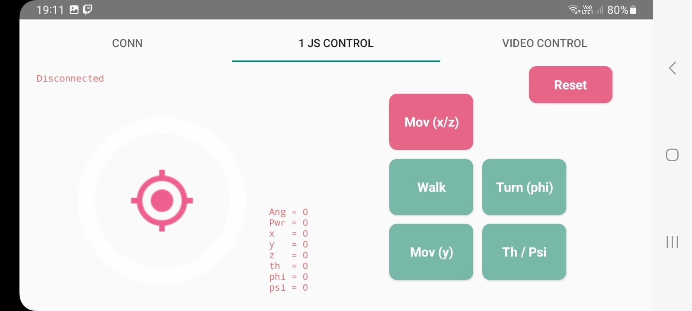
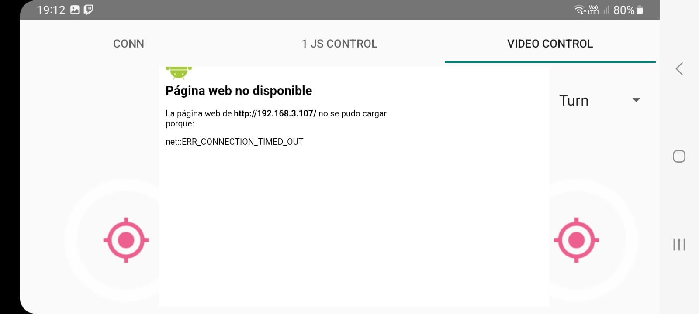

# Spider Sophia Project

Hexapod Spider Robot built from scratch, created to learn robotics and have fun.

## Electronic parts

- 18 Servos MG90S
- ESP32 Board
- ESP32Cam Board
- 2 PCA9685 16-Channel PWM Servo Motor Driver
- 2 LiPo Batteries 3.8V 4480mAh 15C
- BMS 2S HX-2S-JH20
- LTC3780 10A DC-DC Conversor

## Spider in action

 - The Hexapod is capable of move its body frame freely (6 DoF) while remaining static (not walking), only constrained by its legs extension.
 - Walk in any direction and turn if required, multiple gait modes.
 - The state of the body doesn't affect the movement of the hexapod.
 - It cannot jump yet :(

  
  
  

## App

- The Mobile App can connect and communicate to the Esp32 via UDP through Wifi
- You can control the spider in all the directions and even do it walk keeping its position. The buttons in the second picture defines the type of movement to be performed.
- In the third image, you can control the walk (left joystick) + turn (right joystick) while watching through the camera located on the front of the spider.

## APK Releases

https://drive.google.com/drive/folders/1VthdVO_wEmLC-mHvPNjafChNNC0yphkD?usp=sharing

## TODOs
- Path planning & automatic control.
- Some ML techniques.
